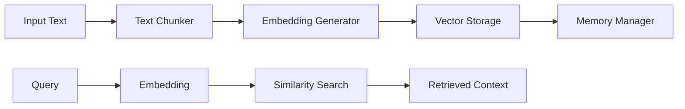

# Vector Store Architecture

## Overview
The vector store system provides long-term memory and learning capabilities for our AI agent system. It enables semantic search, context retention, and knowledge building through vector embeddings.

## Architecture

### Directory Structure
```
backend/
├── vector_store/
│   ├── __init__.py
│   ├── store.py          # Chroma DB management
│   ├── embeddings.py     # Embedding generation
│   └── chunking.py       # Text chunking strategies
```

### Data Flow


## Components

### 1. Text Chunker
- Splits text into semantically meaningful segments
- Maintains context boundaries
- Optimizes chunk size for embedding
- Handles different content types

### 2. Embedding Generator
- Converts text chunks to vector representations
- Manages embedding cache
- Optimizes for performance
- Handles batch processing

### 3. Vector Store (Chroma)
- Stores and manages vector embeddings
- Provides similarity search
- Handles persistence
- Optimizes retrieval

### 4. Memory Manager
- Manages long-term storage
- Handles memory optimization
- Implements caching strategies
- Coordinates component interaction

## Implementation Plan

### Phase 1: Foundation
1. Set up Chroma DB integration
2. Implement basic text chunking
3. Create embedding pipeline
4. Establish basic storage/retrieval

### Phase 2: Enhancement
1. Optimize chunking strategies
2. Implement caching
3. Add batch processing
4. Enhance search capabilities

### Phase 3: Advanced Features
1. Memory optimization
2. Context-aware retrieval
3. Dynamic knowledge updates
4. Performance monitoring

## Usage Examples

### Basic Storage
```python
# Store new information
text = "Important information to remember"
chunks = text_chunker.process(text)
embeddings = embedding_generator.generate(chunks)
vector_store.store(embeddings)
```

### Retrieval
```python
# Retrieve similar context
query = "What information do we have about..."
results = vector_store.similarity_search(query)
```

## Performance Considerations

1. **Memory Usage**
   - Efficient chunk size management
   - Embedding cache optimization
   - Periodic cleanup

2. **Processing Speed**
   - Batch processing for embeddings
   - Optimized search algorithms
   - Cache utilization

3. **Storage Efficiency**
   - Compression strategies
   - Index optimization
   - Cleanup policies

## Integration Points

1. **Manager Agent**
   - Context enhancement
   - Memory persistence
   - Knowledge retrieval

2. **Streaming System**
   - Real-time processing
   - Progressive updates
   - Memory optimization

## Future Enhancements

1. **Advanced Features**
   - Multi-modal embeddings
   - Hierarchical memory
   - Dynamic context windows

2. **Optimizations**
   - Distributed storage
   - Advanced caching
   - Custom embedding models 